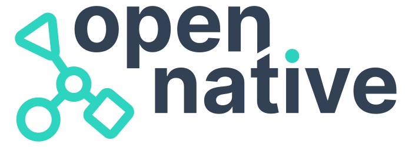
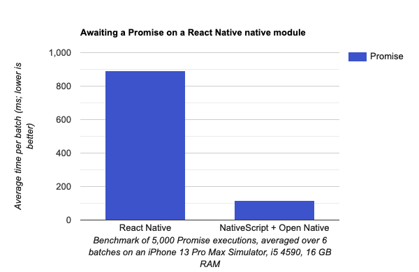

# Introducing Open Native: Native Modules, for all

We all want to build apps in a way that's approachable to us, regardless of the target platform. Projects like React Native, Flutter, Capacitor, and NativeScript enable us to build native (e.g. iOS and Android) apps using alternative idioms such as JavaScript, Web tech, or platform-agnostic UI.

Each of these projects has a way to map platform APIs into their idiom (e.g. React Native has "native modules"), but none are completely mutually compatible. That is to say, a React Native native module cannot be used in a Flutter app as-is, and vice versa. This situation has led to a great amount of duplicated effort, and an isolation of communities.

**Open Native** to the rescue.

<p align="center">
  <picture>
    <source media="(prefers-color-scheme: dark)" srcset="./readme-img/open-native-logo-inverted.svg">
    
  </picture>
</p>

## What is Open Native?

Open Native is the long overdue Rosetta Stone that **allows native modules to be used cross-ecosystem**. It handles all the necessary autolinking, type marshalling and API-binding to allow you to choose the highest quality native module for your project, no matter what ecosystem it comes from.

For our first integration, we've **enabled NativeScript to use React Native native modules** exactly as documented for React Native.

### How does it work?

Open Native **implements just the native module API and autolinking** for a given ecosystem (e.g. React Native) without including any unnecessary core code or CLI tooling. It then exposes the native APIs in an ecosystem-agnostic manner that another framework (e.g. NativeScript) can provide a minimal adapter for.

## How do you use it?

Here's a real example using [react-native-auth0](https://github.com/auth0/react-native-auth0).

### Installation

Install both Open Native and the React Native native module of interest:

```sh
npm install --save @open-native/core react-native-auth0
```

### Webpack configuration

Alter your NativeScript app's webpack config (see [webpack-chain](https://github.com/neutrinojs/webpack-chain) if this looks unfamiliar) as follows:

1. **Mandatory**: alias `react-native` to `@open-native/core`.
2. **As required (see below)**: add a rule to process `react-native-auth0` with `metro-react-native-babel-preset` via `babel-loader`.

```js
webpack.chainWebpack((config) => {
  config.resolve.alias.set('react-native', '@open-native/core');

  config.module
    .rule('rnmodules')
    // For each React Native native module to be processed with Babel, add an
    // 'include' rule here that matches the filepath to its npm package.
    .include.add(/node_modules(.*[/\\])+react-native-auth0/)
    .end()
    .use('babel-loader')
    .before('ts-loader')
    .loader('babel-loader')
    .options({
      babelrc: false,
      presets: ['module:metro-react-native-babel-preset'],
    });
});
```

For many modules, step 2 can be omitted - only certain React Native native modules, distributed with Metro in mind, actually need Babel processing in practice. Simply try building without the rule first and if Webpack throws an errors, try with the rule instead.

### Code

Use the module in NativeScript exactly as you would in React Native:

```js
import Auth0 from 'react-native-auth0';

const auth0 = new Auth0({ domain: 'domain', clientId: 'client_id' });

auth0.webAuth
  .authorize({ scope: 'openid profile email' })
  .then((credentials) => console.log(credentials))
  .catch((error) => console.error(error));
```

## How feature-complete is it?

Rather than a ground-up rewrite, we actually implemented the React Native native module APIs and autolinking process using **the very same code** from the React Native and React Native Community CLI codebases. This ensures excellent consistency and also gives us broad feature coverage.

We are still testing out different native modules and filling in any gaps left. Broadly, we **fully support bridge-based non-UI modules**, and support for TurboModules, codegen, and JSI is under development (and going well!).

UI modules pose some challenges, as they are distributed ultimately as React components and so could only practically be consumed by React-based apps. If there is interest, we may expose the underlying native UI module for non-React frameworks to create components with.

## How is the performance?

Performance of native modules running with Open Native mainly depend on the host runtime's performance. The implementation of native module API uses exactly the same code as the original implementation, however we have made some optimisations with careful consideration for even better performance.

In our first integration with NativeScript, bridge-based native modules perform almost **7-8 times faster** compared to React Native on iOS (see benchmarks below). The difference is large due to the fact that NativeScript is able to call native APIs directly by default without a bridge unlike React Native.

<p align="center">
  <picture>
    
  </picture>
</p>

We've also treated all bridge-based native modules as TurboModules, lazy-loading them until the first API call, so **startup time should not be affected for NativeScript apps**.

As for size, we've taken **just the core code we need**, which is only a small subset of React Native code that is sufficient to run native modules.

## Is it production-ready?

Open Native is **already in use in production** by [nStudio](https://nstudio.io) - it has enabled them to use [react-native-auth0](https://github.com/auth0/react-native-auth0) in their NativeScript apps off-the-shelf to fill in some key Auth0 functionality that would otherwise have needed to be written for two platforms from scratch.

## What's next?

Allowing React Native native modules to be used in additional ecosystems would be a relatively small task from here, as we've done most of the groundwork (implementing autolinking and the bridge module API in an ecosystem-agnostic manner) already. Other ecosystems would mainly just need to contribute adapters for the final step, namely invoking APIs on the native modules from a non-native context.

Additional integrations can also be tackled in time, e.g. allowing Flutter platform channels, Capacitor plugins, and NativeScript plugins to be used in other ecosystems. Please do get in touch if you think you could be of help, as there's only so much we can tackle on our own!

For now, we're happy just to have pushed the first domino in allowing communities to work together on solving the same problems.

To keep updated on future developments and the blog posts to come, you can follow this repo (a star would be nice, too!) and, humbly, ourselves:

- **Ammar Ahmed**: [Twitter](https://twitter.com/ammarahm_ed), [GitHub](https://github.com/ammarahm-ed)
- **Jamie Birch**: [Twitter](https://twitter.com/LinguaBrowse), [GitHub](https://github.com/shirakaba)

## Thanks to

- **[Nathan Walker](https://github.com/NathanWalker/)**: For helping us time and time again with the NativeScript CLI, hooks, and project setup.
- **[Igor Randjelovic](https://github.com/rigor789)**: For the stunning project logo.
- **[Osei Fortune](https://github.com/triniwiz)**: For his expert help with the NativeScript Android runtime.
- **[Eduardo Speroni](https://github.com/edusperoni/)**: For his expert help with v8 as we take on JSI.
- **[The NativeScript Community](https://discord.com/invite/RgmpGky9GR)**: For being awesome day after day. It's hard to name everyone who helped us and encouraged us to accomplish this.
- **[React Native](https://github.com/facebook/react-native)**: We both have a background in React Native and were able to learn a lot from it. This wouldn't have been possible without React Native and the communities around it.

## MIT License
